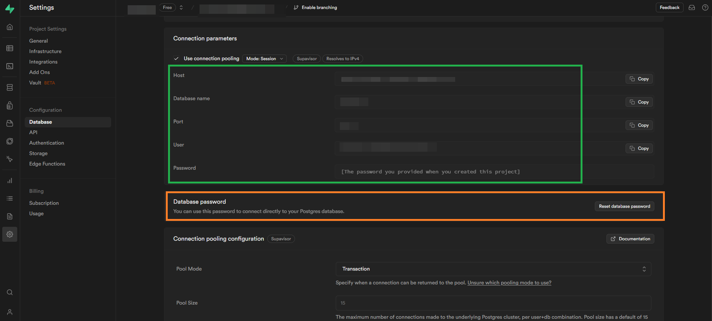
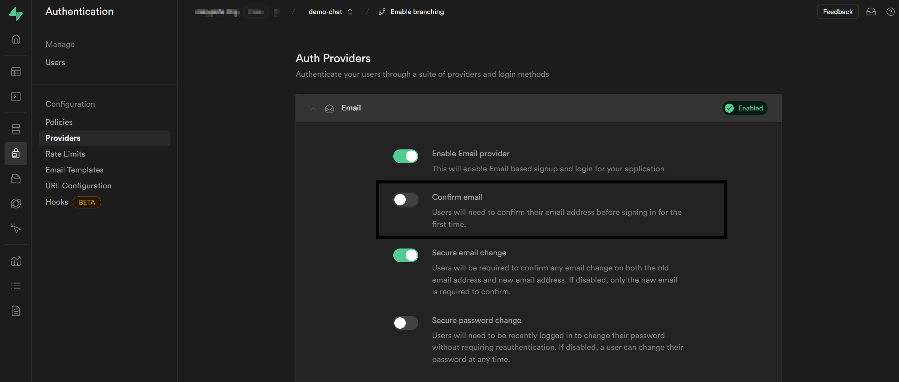

<br>

<p align="center">
  <a href="https://flyer.chat">
    
  </a>
</p>

<h1 align="center">Flutter Supabase Chat Core</h1>

<p align="center">
    This project is an implementation of the <a href="https://pub.dev/packages/flutter_chat_types">flutter_chat_types</a>, <a href="https://pub.dev/packages/flutter_chat_ui">flutter_chat_ui</a> packages based on a backend created with <a href="https://supabase.com/">Supabase</a>.
</p>

<br>

<p align="center">
  Actively maintained, community-driven Supabase BaaS for chat applications with an optional <a href="https://pub.dev/packages/flutter_chat_ui">chat UI</a>.
</p>

<br>

<p align="center">
  ⚠️⚠️ Recommended for small or PoC projects, might not be optimized for large amounts of data. I suggest to use this on a free plan, otherwise be extremely cautious. ⚠️⚠️
</p>

<br>

<p align="center">
  <a href="https://pub.dartlang.org/packages/flutter_supabase_chat_core">
    
  </a>
  <a href="https://github.com/insideapp-srl/flutter_supabase_chat_core/actions?query=workflow%3Abuild">
    
  </a>
  <a href="https://www.codefactor.io/repository/github/insideapp-srl/flutter_supabase_chat_core">
    
  </a>
</p>

<br>

<p align="center">
  <a href="https://flyer.chat">
    
  </a>
</p>

<br>

Have you ever wanted to implement a chat in your application? Do you think it's difficult and complex?

Try this, thanks to the magnificent [Supabase](https://supabase.com/) platform and the [Flutter Chat UI](https://pub.dev/packages/flutter_chat_ui) package, you can achieve it in just a few minutes and effortlessly.

---

Flyer Chat is a platform for creating in-app chat experiences using Flutter. This repository contains Supabase BaaS implementation for Flutter. We are also working on our more advanced SaaS and self-hosted solutions.

* **Free, open-source and community-driven**. We offer no paid plugins and strive to create an easy-to-use, almost drop-in chat experience for any application. Contributions are more than welcome! Please read our [Contributing Guide](CONTRIBUTING.md).

* **Chat UI agnostic**. You can choose the chat UI you prefer. But if you don't have one, we provide our own free and open-source [Flutter Chat UI](https://pub.dev/packages/flutter_chat_ui), which can be used to create a working chat in minutes.

* **Easy to use**. Returns streams of data for messages, rooms and users. [Supabase Security Rules](https://supabase.com/docs/guides/database/postgres/row-level-security) control access to the data. Check our [documentation](https://flutter-supabase-chat-core.insideapp.it/guides/supabase-security) for the info.

## Getting Started

The example project that you find in the package repository allows you to have a cross-platform chat app in just a few minutes.

### Requirements

`Dart >=2.19.0` and `Flutter >=3.0.0`, [Supabase](https://supabase.com) project.

### Create a Supabase project

1. Install Supabase CLI: [Official documentation](https://supabase.com/docs/guides/cli/getting-started)
2. Open your bash
3. Login with Supabase:

```bash
supabase login
```

4. Create new project (For example `demo-chat`):

```bash
supabase projects create demo-chat
```

5. Select your organization
6. Select an region
7. Insert a secure password for new Postgres database (Save this in a secure location)
8. Obtain your `REFERENCE ID` (After command select your project, for example `demo-chat`):

```bash
supabase projects list
```

9. Obtain your `anon` key (After command select your project, for example `demo-chat`):

```bash
supabase projects api-keys
```
10. Edit `example project` file `example/lib/supabase_options.dart`, insert your project `{{your_project_reference_id}}` and `{{supabase_anon_key}}`

#### Prepare Supabase project

Inside the example project (`example/utils`) there is a script, running the latter will automatically configure the Supabase project, creating tables, security rules, buckets and everything that is necessary for the example project to function.

In order to run the script you need to be aware of the following information about your Supabase project:

- `host` : Project host
- `port` : Database port
- `database` : Database name
- `user` : Database user
- `password` : Database password

This information, except the password which is provided only during the creation of the database (if necessary, you can use the password reset function of your database to obtain it), can be found very easily from the Dashboard of your Supabase project:



#### Running prepare script

Below are the commands for running the scripts (During execution you will be asked for the password for your database user):

>   Required `psql` installed -> [Official documentation](https://www.postgresql.org/download/)

#### Linux

```bash
cd ./example/utils/
./prepare.sh -h "your-postgres-host" -p your-postgres-port -d "your-postgres-database-name" -U "your-postgres-user"
```

#### Windows

```powershell
cd .\example\utils\
.\prepare.ps1 -hostname "your-postgres-host" -port your-postgres-port -database "your-postgres-database-name" -user "your-postgres-user"
```

after running the database preparation script. you need to change the database schema exposure setting by adding the `chats` schema (from the supabase dashboard):


Optional (**Only for test**): Disable email verification and save the configuration (To speed up testing and allow user registration in just one click, it is advisable to disable mailbox verification):



Read our [documentation](https://flutter-supabase-chat-core.insideapp.it) or see the [example](https://github.com/insideapp-srl/flutter_supabase_chat_core/tree/main/example) project. To run the example project you need to have your own [Supabase](https://supabase.com/dashboard/projects) project and then follow [Add Supabase to your Flutter app](https://supabase.com/docs/reference/dart/initializing), override `example/lib/supabase_options.dart`, don't commit it though 😉

After all of this is done you will need to register a couple of users and the example app will automatically suggest email and password on the register screen, default password is `Qawsed1-`. To set up [Supabase Security Rules](https://supabase.com/docs/guides/database/postgres/row-level-security) so users can see only the data they should see, continue with our [documentation](https://flutter-supabase-chat-core.insideapp.it/).

## Package Widgets

This package implements some purely logical widgets (Without implementation of a specific UI). These wedgets make it easy to implement some chat-related logic without any effort.

### UserOnlineStateObserver

This widget should be placed in the widget tree as soon as possible, this is because this component is responsible for checking and updating the status of the user who logged into the app. When the app is in the foreground other users are notified of the online status, vice versa when the app is closed.

```dart
@override
Widget build(BuildContext context) =>
    MaterialApp(
      ...
      home: const UserOnlineStateObserver(
        child: RoomsPage(),
      ),
    );
```

### UserOnlineStatusWidget

This server widget to get the status of a specific user. It can be used, for example, to animate a user's avatar with an LED to indicate their online/offline status.

```dart
@override
Widget build(BuildContext context) {
  return UserOnlineStatusWidget(
      uid: user.id,
      builder: (status) {
        //Use status == UserOnlineStatus.online to animate your avatar
      },
  );
}
```

## RLS (Row level security)

The preparation script automatically configures the security rules on the database tables and storage buckets, below is a summary of the rules that are applied:

### Tables

#### Table `chats.users`

- `INSERT` : Nobody, this table is populate by trigger on auth.users. 
- `SELECT` : All users authenticated.
- `UPDATE` : Only the user himself.
- `DELETE` : Nobody.

#### Table `chats.rooms`

- `INSERT` : All users authenticated.
- `SELECT` : All users who are members of the chat room.
- `UPDATE` : All users who are members of the chat room.
- `DELETE` : All users who are members of the chat room.

#### Table `chats.messages`

- `INSERT` : All users who are members of the chat room.
- `SELECT` : All users who are members of the chat room.
- `UPDATE` : All users who are members of the chat room.
- `DELETE` : All users who are members of the chat room.

### Storage buckets

#### Bucket `chats_assets`

- `INSERT` : All users who are members of the chat room.
- `SELECT` : All users who are members of the chat room.
- `UPDATE` : All users who are members of the chat room.
- `DELETE` : All users who are members of the chat room.

#### Bucket `chats_user_avatar`

- `INSERT` : Only the user himself.
- `SELECT` : All users authenticated.
- `UPDATE` : Only the user himself.
- `DELETE` : Only the user himself.

## Contributing

Please read our [Contributing Guide](CONTRIBUTING.md) before submitting a pull request to the project.

## Code of Conduct

Flyer Chat has adopted the [Contributor Covenant](https://www.contributor-covenant.org) as its Code of Conduct, and we expect project participants to adhere to it. Please read [the full text](CODE_OF_CONDUCT.md) so that you can understand what actions will and will not be tolerated.

## License

Licensed under the [Apache License, Version 2.0](LICENSE)

## Example project progress

Below are the features implemented for each platform:

| Feature                  | Web | Android | iOS | Windows | macOS | Linux |
|--------------------------|:---:|:-------:|:---:|:-------:|:-----:|:-----:|
| Signup                   |  ✅  |    ✅    | 🟡  |    ✅    |  🟡   |  🟡   |
| SignIn                   |  ✅  |    ✅    | 🟡  |    ✅    |  🟡   |  🟡   |
| Rooms list screen        |  ✅  |    ✅    | 🟡  |    ✅    |  🟡   |  🟡   |
| Create direct room       |  ✅  |    ✅    | 🟡  |    ✅    |  🟡   |  🟡   |
| Create group room        | 🚧  |   🚧    | 🚧  |   🚧    |  🚧   |  🚧   |
| Create channel room      | 🚧  |   🚧    | 🚧  |   🚧    |  🚧   |  🚧   |
| Chat screen              |  ✅  |    ✅    | 🟡  |    ✅    |  🟡   |  🟡   |
| Search room              |  ✅  |    ✅    | 🟡  |    ✅    |  🟡   |  🟡   |
| Search message           | 🚧  |   🚧    | 🚧  |   🚧    |  🚧   |  🚧   |
| Search user              |  ✅  |    ✅    | 🟡  |    ✅    |  🟡   |  🟡   |
| Upload image             |  ✅  |    ✅    | 🟡  |    ✅    |  🟡   |  🟡   |
| Preview image message    |  ✅  |    ✅    | 🟡  |    ✅    |  🟡   |  🟡   |
| Upload file              |  ✅  |    ✅    | 🟡  |    ✅    |  🟡   |  🟡   |
| Download file            |  ✅  |    ✅    | 🟡  |    ✅    |  🟡   |  🟡   |
| Users online status      |  ✅  |    ✅    | 🟡  |    ✅    |  🟡   |  🟡   |
| Chat messages pagination |  ✅  |    ✅    | 🟡  |    ✅    |  🟡   |  🟡   |
| Users pagination         |  ✅  |    ✅    | 🟡  |    ✅    |  🟡   |  🟡   |
| Users typing status      |  ✅  |    ✅    | 🟡  |    ✅    |  🟡   |  🟡   |

- ✅ Tested
- 🟡 Supported but not tested
- 🚧 Planned

## Activities to complete (Roadmap)

Below are some activities to complete to have a more complete and optimized project also for use cases in larger projects.

1. Add the missing triggers
2. Error handling
3. Chat room groups
4. Chat room channels
5. Sending audio messages
6. Improve documentation

